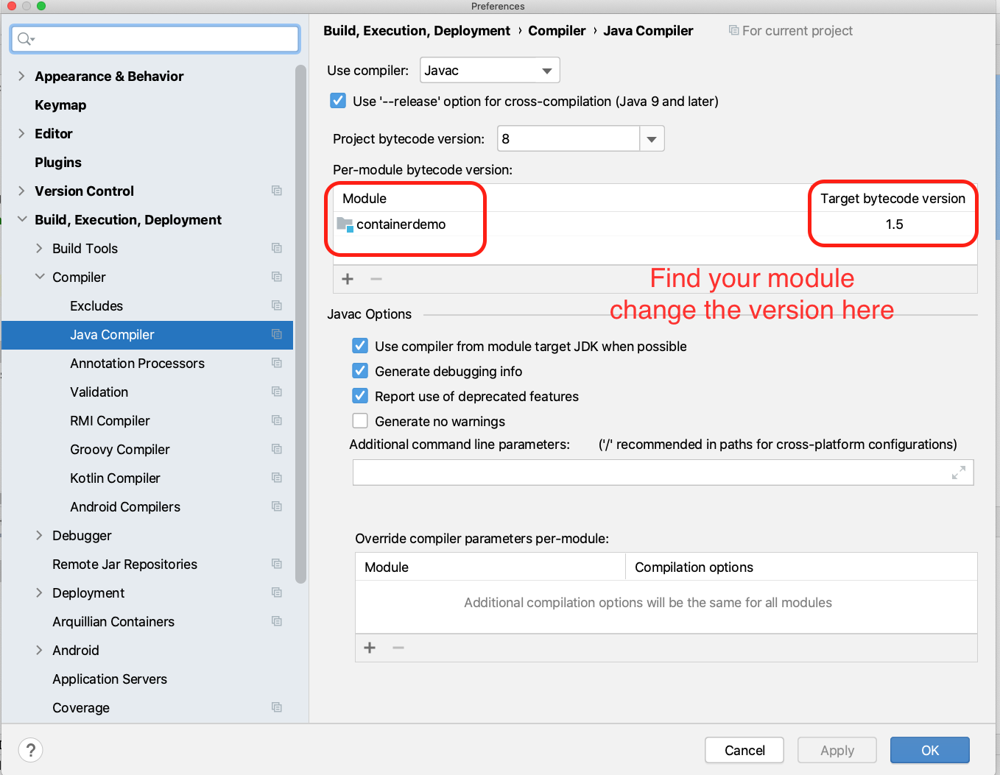

# Intellij - Maven Project - java: error: release version 5 not supported

There are chances which you may run this error when you run a Java project in Intellij.\
Here are the steps I did:

1. Create a simple Maven Project without using archetype
2. Create a simple Java class like below:
```java
package miss.xing;

public class Container {

    public static void main(String[] args) {
        System.out.println("Container...");
    }
}
```
3. Run the application, you may see the error below:
```diff
- java: error: release version 5 not supported
```

How can we solve this issue?
It's actually simple.\

In the toolbar, find \
Intellij IDEA -> Preferences -> Build, Execution, Deployment -> Java Compiler \
On the right panel, find your module, change "Targeted bytecode version" to the version you need. The default one is set to 1.5


